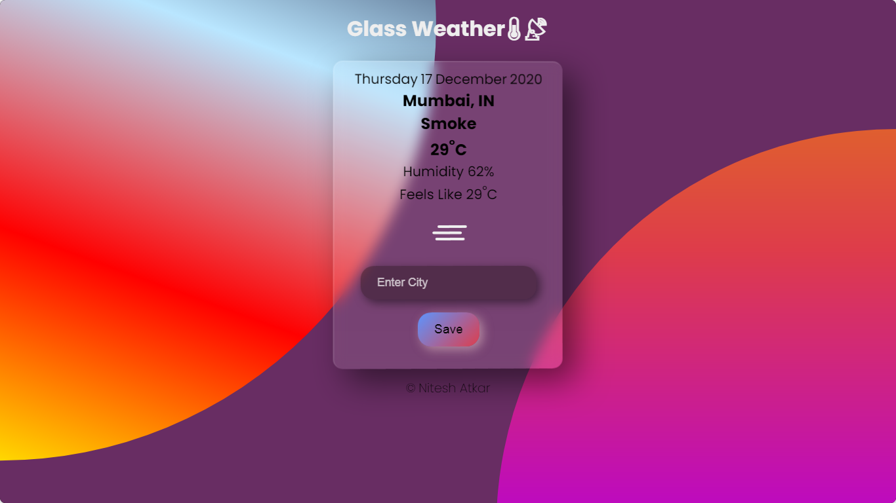

# Glass Weather
---
### Simple Weather UI showcasing Glassmorphism Design
> **Link**
[GlassWeather](https://niteshatkar.github.io/GlassWeather/ "GlassWeather")
---

### Screenshots

 
***
### Tech Used
* [OpenWeatherMap API](https://openweathermap.org/api "OpenWeatherMap")
* [Vanilla Tilt JS Library](https://micku7zu.github.io/vanilla-tilt.js/ "Vanilla Tilt")
* [Weather Icons](https://bas.dev/projects/weather-icons "Weather Icons") @basmilius
---